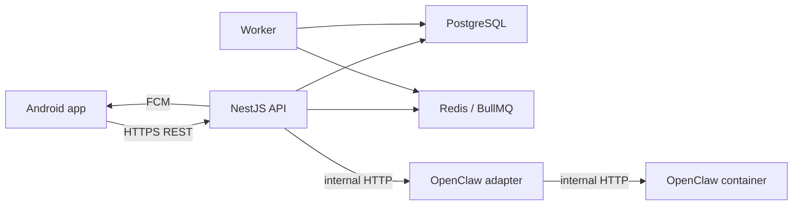

# Architecture

## Runtime Topology

## Authority Boundaries

- PostgreSQL is the source of truth for family, schedules, missions, proofs, coins, alerts, and chat history.
- OpenClaw is advisory. It can produce messages and action drafts, but it cannot directly mutate application state.
- The API validates every schedule or snooze action against role and mission policy before saving.
- Android caches upcoming missions and local alarms, then syncs changes back to the API.

## V1 Mutation Rule

Chat-originated schedule changes always become `chat_action_drafts`. They are applied only after explicit user confirmation and backend RBAC validation.

## Deployment Topology

The backend runs on a Hostinger VPS via Docker Compose, and the OpenClaw container runs on the same host and Docker network so the `openclaw-adapter` can reach it privately. The Android app talks to the API over HTTPS through the Caddy reverse proxy. Full service table, ports, and the real-OpenClaw wiring are in [deployment.md](deployment.md).

## Device Action Bridge Flow

The Device Action Bridge lets OpenClaw interact with other Android apps on a family device, mediated entirely through the server — OpenClaw never touches a device directly. It reuses the V1 mutation rule (advisory → draft → validate → confirm), pointed at the device instead of the database:

1. OpenClaw (via the adapter) emits a capability request as an action draft, only if the capability is in `allowedActions`.
2. The server validates RBAC + policy; sensitive capabilities require user/parent confirmation.
3. The server writes a `device_commands` record (`pending`) and sends an FCM data ping to wake the device.
4. The device pulls pending commands over authenticated REST (REST is the source of truth; the ping is best-effort).
5. The matching on-device capability handler executes via an OS mechanism, respecting runtime permissions.
6. The device POSTs the result; the server stores and audits it, then feeds it back to OpenClaw.

Full data model, capability set, safety model, and testing seams are in [features/device-action-bridge.md](features/device-action-bridge.md).

