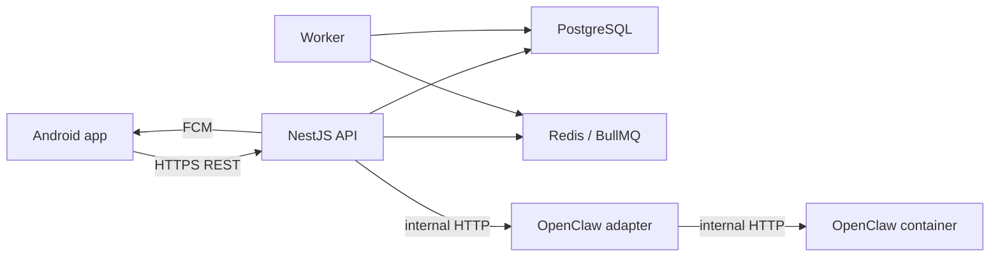

# Architecture

## Runtime Topology

## Authority Boundaries

- PostgreSQL is the source of truth for family, schedules, missions, proofs, coins, alerts, and chat history.
- OpenClaw is advisory. It can produce messages and action drafts, but it cannot directly mutate application state.
- The API validates every schedule or snooze action against role and mission policy before saving.
- Android caches upcoming missions and local alarms, then syncs changes back to the API.

## V1 Mutation Rule

Chat-originated schedule changes always become `chat_action_drafts`. They are applied only after explicit user confirmation and backend RBAC validation.

